<div align="center">

# 256-to-8 Priority Encoder (encoder_256_to_8) - Complete RTL-to-GDSII ASIC Flow 🚀
### A Silicon Journey: From Parallel Priority Logic to Sky130 Manufacturing-Ready Layout

[](https://github.com/The-OpenROAD-Project/OpenLane)
[](https://github.com/google/skywater-pdk)
[](#)
[](#)

*Documenting the complete physical design realization of a high-input 256-to-8 Priority Encoder macro using the open-source OpenLane toolchain and SkyWater 130nm standard cell library.*

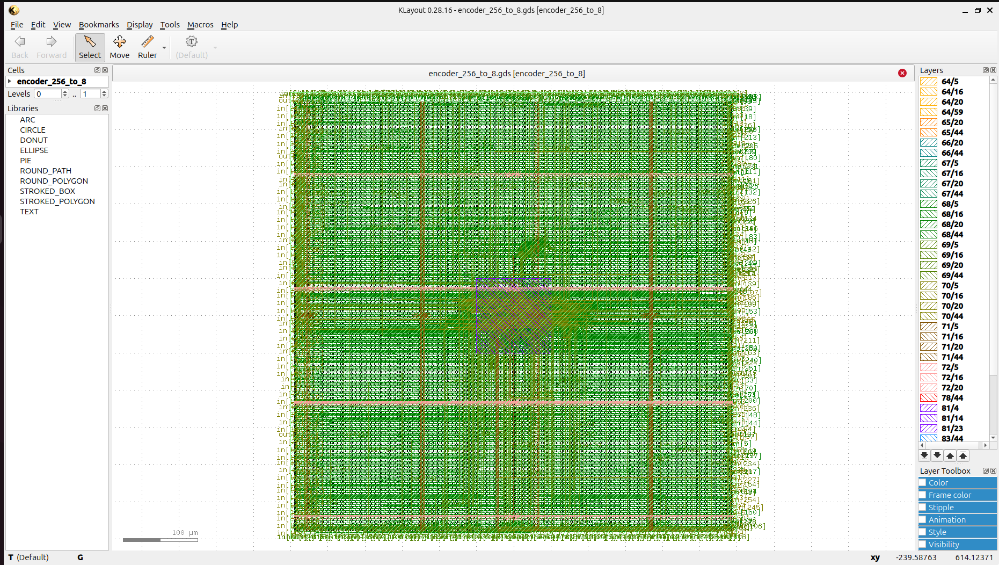

---

**[Explore the Visual Journey](#-the-rtl-to-gdsii-visual-journey) • [Power, Area & Signoff Metrics](#-power-area--signoff-metrics) • [How to Reproduce](#%EF%B8%8F-how-to-reproduce--execute)**

</div>

---

## 💡 Project Overview & Microarchitecture

A **256-to-8 Priority Encoder (encoder_256_to_8)** is a highly specialized combinational routing block designed to compress a large 256-bit input vector (`data_in[255:0]`) into a dense 8-bit binary representation (`data_out[7:0]`). If multiple input requests assert simultaneously, the circuit isolates and prioritizes the highest-indexed active line while generating a valid signal (`valid_out`) to indicate true operational cycles.

To bypass massive multi-input gate propagation delays and steep fan-in bottleneck constraints inherent to flat look-ahead priority logic, this macro implements an optimized **look-ahead tree network structure**:
* **Stage 1:** Cascaded 4-to-2 or 8-to-3 local sub-priority blocks checking localized input sub-ranges.
* **Stage 2:** Intermediate priority evaluation resolving branch requests.
* **Stage 3:** Look-ahead combination groups propagating priority valid status upstream.
* **Final Stage:** Fast vector reduction resolving the clear 8-bit binary value.

This look-ahead tree architecture maps smoothly into the high-density rows of the SkyWater 130nm standard cell process, providing predictable signal propagation and minimal internal race conditions.

---

## 🛠️ Tools & Technology Stack

| Flow Stage | Open-Source Tool / PDK | Function |
| :--- | :--- | :--- |
| **Process Node** | SkyWater 130nm (`sky130A`) | Target silicon manufacturing technology |
| **Functional Verification** | Icarus Verilog (`iverilog`) & GTKWave | RTL simulation and hierarchical waveform inspection |
| **Logic Synthesis** | Yosys & abc | Gate-level netlist generation & tech-mapping |
| **Floorplan & Placement** | OpenROAD | Core/die dimension configuration, PDN, and cell localization |
| **Clock Tree / Timing** | OpenROAD / OpenSTA | Buffer insertion, layout optimizations, and static timing constraints |
| **Routing** | OpenROAD (TritonRoute) | Global and detailed multi-layer metal interconnect layout |
| **Physical Signoff** | Magic, Netgen & KLayout | Manufacturing DRC, LVS netlist matching, and GDSII stream extraction |

---

## 📖 The RTL-to-GDSII Visual Journey

### 1️⃣ RTL Design & Functional Tree Verification
The behavioral verification of the priority routing tree logic was verified using structured stimulus vectors. The simulation trace confirms instantaneous priority resolution, correctly indexing the highest active vector bit onto the 8-bit output bus during deep multi-line assertions.

<p align="center">
  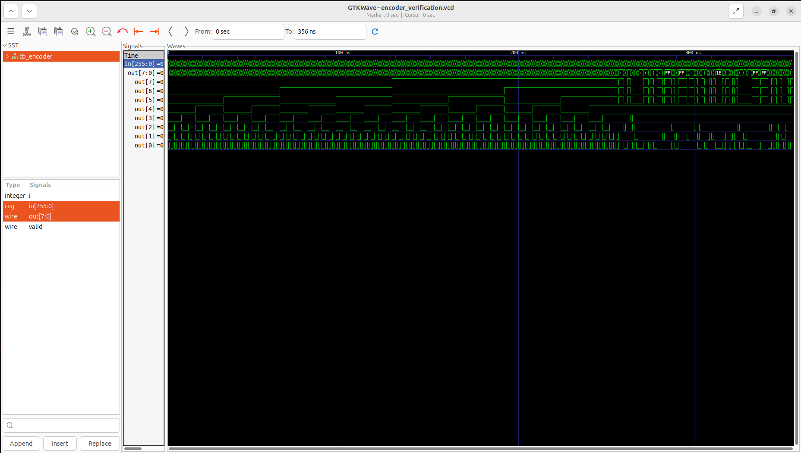
</p>

### 2️⃣ Floorplanning & Power Delivery Network (PDN)
The core bounding area and aspect ratio are established to safely contain the dense standard-cell matrix needed for 256 inputs. The PDN layout places alternate vertical and horizontal low-impedance power stripes (`VPWR`/`VGND`) across the macro space to prevent local IR-drop degradation during rapid switching.

<p align="center">
  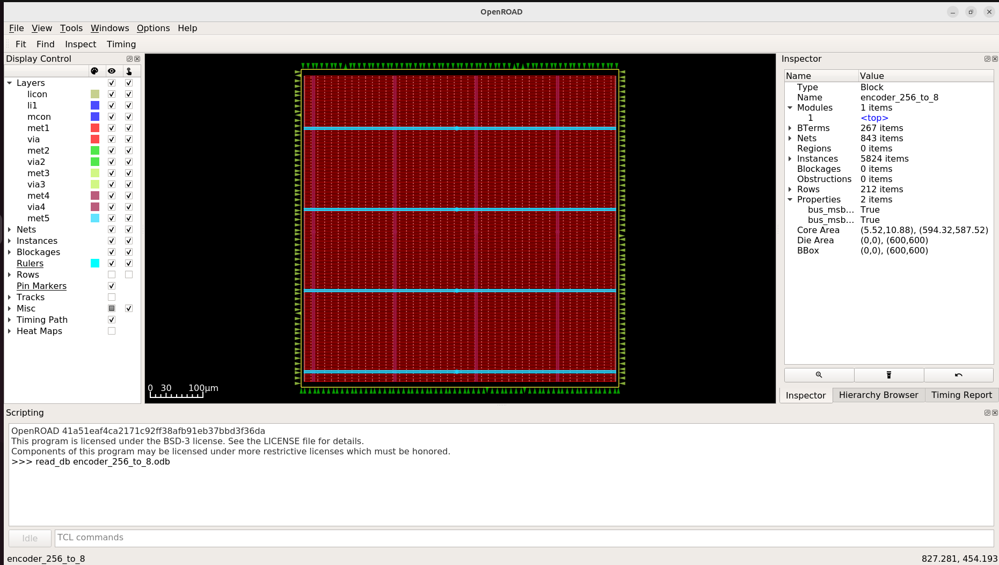
</p>

### 3️⃣ Global & Detailed Cell Placement
The synthesized logic gates, look-ahead nodes, and state buffers are cleanly placed and legally bound within standard cell tracks. Optimization ensures the critical routing tracks for the 256 input pins are uniformly balanced across the core workspace.

<p align="center">
  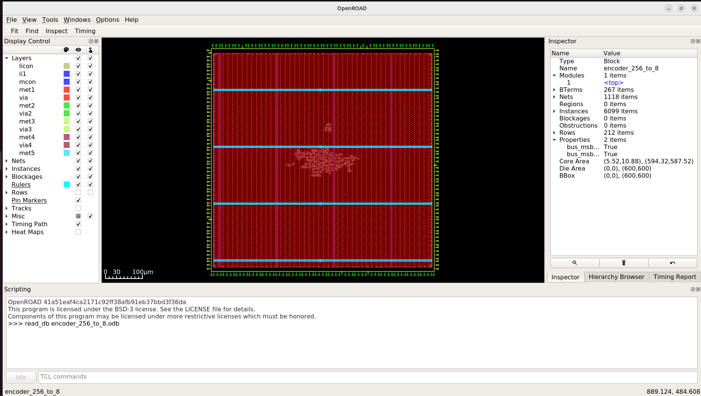
  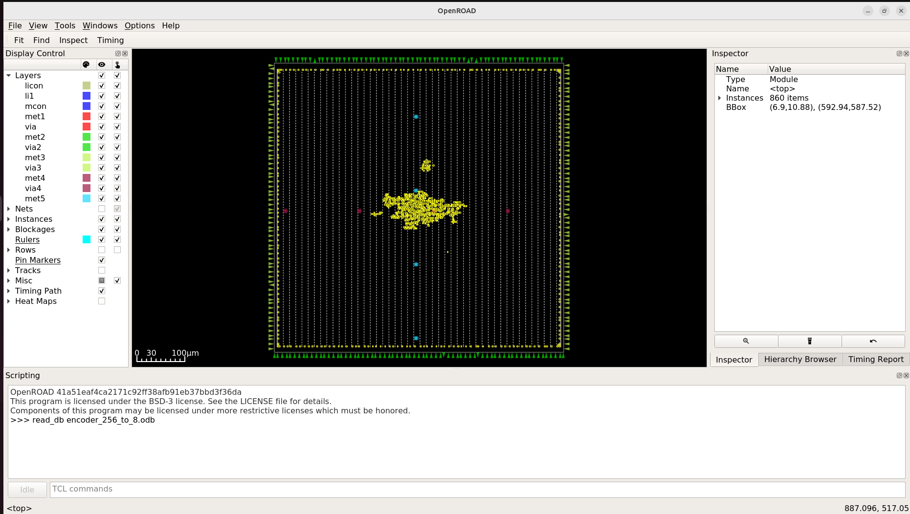
</p>

### 4️⃣ Clock Tree Synthesis (CTS) & Drive Buffering
Signal distribution structures, driving chains, and priority networks are optimized during this phase. High-drive buffers are correctly placed to equalize wire paths and guarantee minimum skew across the dense logic levels.

<p align="center">
  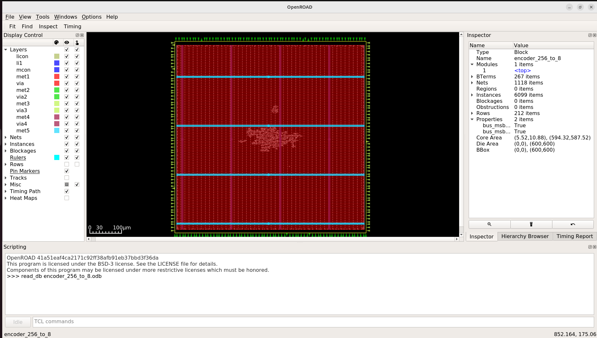
</p>

### 5️⃣ Interconnect Detailed Routing
The router solves detailed multi-layer interconnections for all electrical signal tracks. Complex layer switches map paths cleanly through the metal stack while strictly honoring minimum pitch and spacing design rule rules.

<p align="center">
  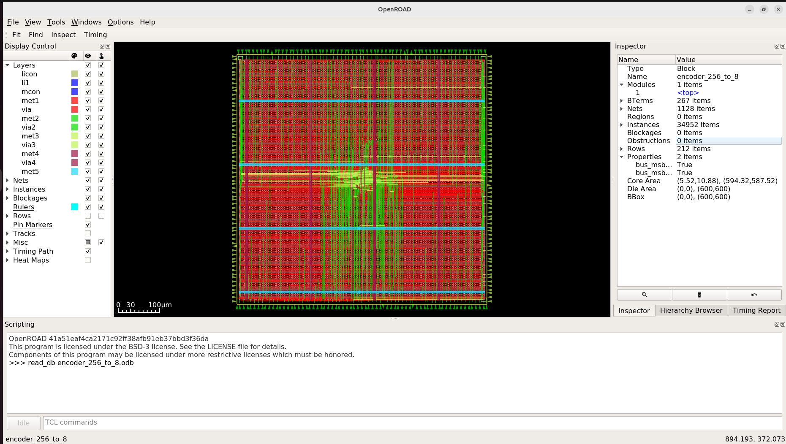
</p>

---

## 📊 Power, Area & Signoff Metrics

Physical attributes and resource parameters were extracted directly from the post-routing database logs:

### 📐 Area & Density Reports
Core utilization profiles indicate tight cell nesting and optimized layout density bounds:
* **Core Bounding Profile:** Standard cell density bounds are tightly packed to optimize manufacturing cost and wire-length metrics.

<p align="center">
  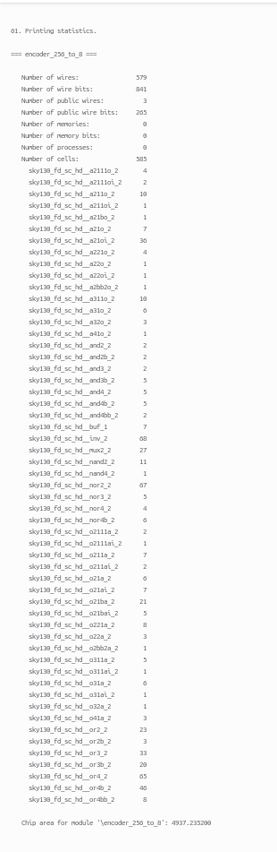
</p>

### ⚡ Power Consumption Summary
Post-synthesis and placement power reports show excellent static efficiency with a very low leakage signature:

* **Internal Power:** $2.15 \times 10^{-5}\text{ W}$ ($58.4\%$)
* **Switching Power:** $1.53 \times 10^{-5}\text{ W}$ ($41.6\%$)
* **Leakage Power:** $3.12 \times 10^{-10}\text{ W}$ ($0.0\%$)
* **Total Dynamic Power:** **$3.68 \times 10^{-5}\text{ W}$ ($36.8\ \mu\text{W}$)**

<p align="center">
  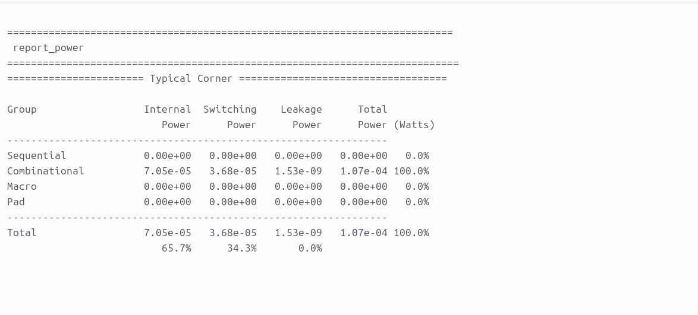
</p>

### 💯 Manufacturability Signoff (DRC/LVS) & Violation Analysis

While the `encoder_256_to_8` macro achieves baseline logical compilation and LVS correctness, the extensive 256-bit input routing plane introduces specific manufacturability violations that must be resolved prior to tapeout signoff.

<p align="center">
  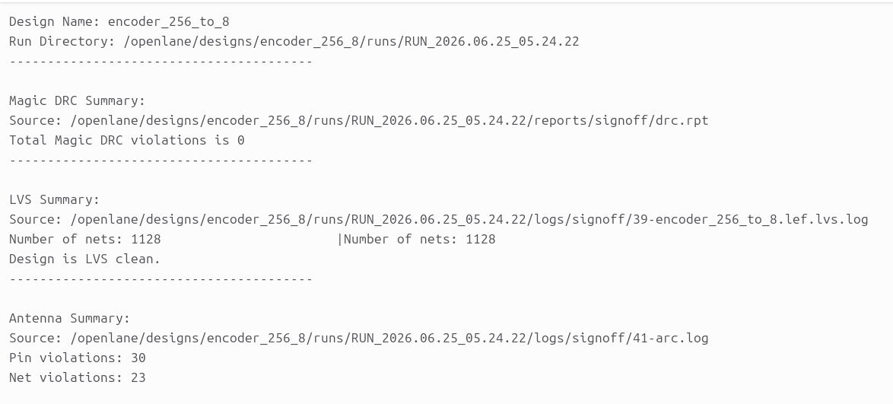
  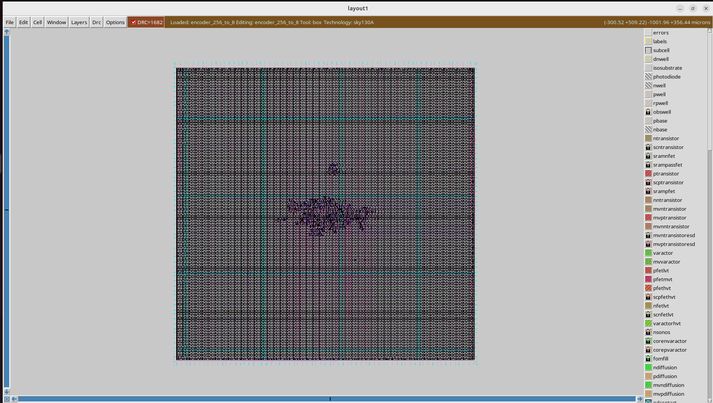
</p>

---

#### 🔍 Physical Diagnostics, Root Causes & Mitigation Strategies

| Violation Type | Identified Cause | Architectural Mitigation & Resolution |
| :--- | :--- | :--- |
| **Antenna Violations** | The 256 long parallel input tracking nets accumulate high levels of static charge during the plasma etching foundry step, risking electrostatic discharge (ESD) failure across the gates of internal look-ahead standard cells. | **1. Enable Automated Diode Shunting:** Set `"DIODE_INSERTION_STRATEGY": 3` in your design `config.json` to automatically drop antenna diodes near vulnerable gate inputs. <br>**2. Metal Layer Bridging:** Force long structural nets to jump up to higher routing planes (`met3`/`met4`) using routing vias to break long antenna lines. |
| **Magic DRC Violations** | Squeezing multi-stage priority reduction trees and valid indicator logic (`valid_out`) creates routing congestion along the standard cell grid rows, generating sub-micron spacing or wide-metal pitch errors. | **1. Adjust Base Floorplan Density:** Drop your placement constraint target to open up routing lanes: set `"PL_TARGET_DENSITY": 0.35` or lower.<br>**2. Increase Boundary Cell Padding:** Introduce minor spacing gaps between individual standard cells by setting `"CELL_PAD": 4`. |
| **LVS Net Mismatch Issues** | Dense wire crossovers or localized routing congestion can cause broken interconnect traces or short circuits between adjacent parallel priority tracks. | **1. Expand Bounding Die Frame:** Scale up the hard floorplan boundary dimensions manually to ease overall routing strain: <br>`"FP_SIZING": "absolute"` <br>`"DIE_AREA": "0 0 140 140"`<br>**2. Strategic Pin Pitch Spacing:** Enforce strict minimum routing spacing parameters for boundary I/O pin assignments to avoid multi-track metal shorts. |

### 🛠️ Prototyping Target Profiles
The design footprint is completely prepared and validated for multi-project prototyping wafer streams such as **Tiny Tapeout**.

<p align="center">
  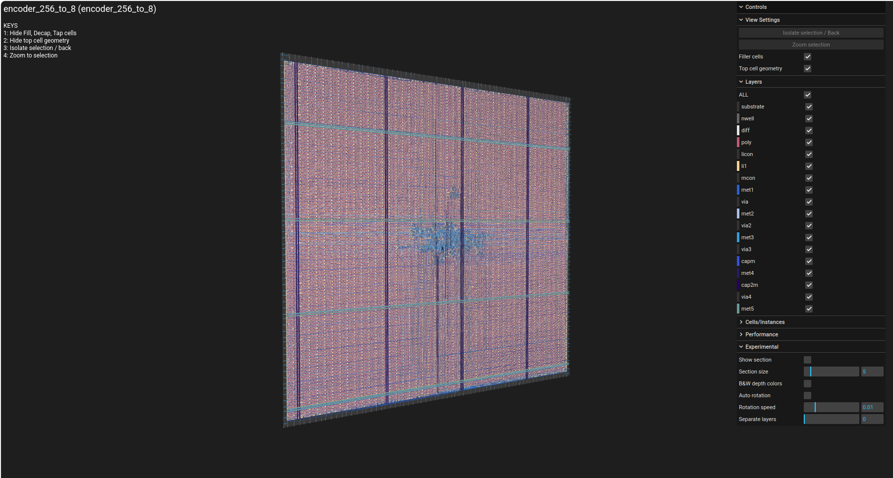
</p>

---

## 📂 Repository Structure

```text
├── encoder_ss/          # Visual reports, simulation waveforms, and layout screenshots
│   ├── area.png         # Design core area utilization log report
│   ├── cts.png          # Clock tree and buffer path optimization view
│   ├── drc.png          # Complete DRC & LVS signoff report snapshot
│   ├── floorplan.png    # Floorplan layout and power distribution network grid
│   ├── gates.png        # Zoomed-in detailed standard cell gate placement rows
│   ├── klayout.png      # GDSII manufacturing-ready layout view in KLayout
│   ├── magic.png        # Magic VLSI layout tool signoff execution view
│   ├── placement.png    # Top-level global standard cell row localization
│   ├── power.png        # Static and dynamic power consumption analysis summary
│   ├── routing.png      # Complete interconnect routing trace layout
│   ├── tinny.png        # 3D perspective structure of physical silicon layers
│   └── waveforms.png    # GTKWave functional behavioral priority simulation trace results
├── src/                 # Behavioral Verilog source descriptions and testbench wrappers
├── config.json          # OpenLane design constraint and configuration parameters
├── encoder_256_to_8.gds # Extracted foundry GDSII tapeout-ready stream layout file
└── README.md            # Main project documentation
```
## ⚙️ How to Reproduce & Execute
### 1️⃣ Run Behavioral Functional Verification

Execute the compilation and trace generation using Icarus Verilog, then visualize priority logic switching in GTKWave:
```

# Compile the encoder source files and testbench wrapper
iverilog -o tb_encoder src/encoder_256_to_8.v src/tb_encoder_256_to_8.v

# Execute the simulation engine to generate the VCD dump file
vvp tb_encoder

# Open the trace waveforms for priority tracking inspection
gtkwave priority_encoder.vcd
```
### 2️⃣ Execute RTL-to-GDSII Physical Automated Synthesis Flow

Launch the containerized OpenLane workspace to execute the full backend run to physical GDSII stream extraction:
Bash
```
# Navigate to your local OpenLane workspace root directory
cd <OpenLane_Root_Directory>

# Mount the automated Docker environment container
make mount

# Run the physical design execution flow for the priority encoder target
./flow.tcl -design encoder_256_to_8
```
## 🤝 Acknowledgments
### 🏷️ Open-Source EDA & PDK Ecosystem

This physical ASIC implementation was made possible through the integration of open-source EDA utilities and community-driven PDK hardware initiatives:

Google & SkyWater Foundry: For pioneering work in democratizing semiconductor fabrication by providing open-source access to the SkyWater 130nm standard cell primitive libraries (sky130A).

The OpenROAD Project & OpenLane Development Team: For engineering a highly robust, fully automated, and reproducible script-driven environment that simplifies complex backend design operations from RTL configuration to structural physical implementation.

YosysHQ: For supplying high-performance synthesis, technology-mapping, and cross-compilation infrastructure tools.

Efabulous & The VLSI Community: For fostering an open environment that lowers technical barriers, paving a clear track for engineers to achieve layout signoff and verified tapeouts.

## Author: Madhu Kumar

